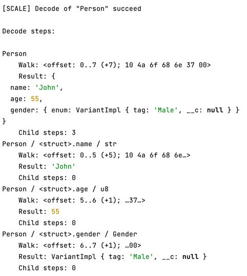
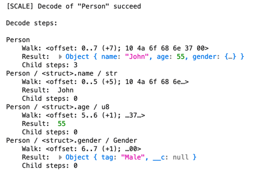

# @scale-codec/definition-runtime   

Runtime for `@scale-codec/definition-compiler`. Includes standard codecs (such as `U8`, `Str`, `Bool`, `Unit` etc), codec factories and [logging facilities](#tracking-and-logging).

## Installation

Available on NPM:

```shell
npm i @scale-codec/definition-compiler
```

## Usage

Usually, this package is paired with the output of the compiler. It is the library that the compiled code imports utilities from.

For advanced usage you can explore [`@scale-codec/definition-runtime` API](https://soramitsu.github.io/scale-codec-js-library/api/modules/scale_codec_definition_runtime).

## Tracking and Logging

All codecs use tracking API. For now, there is no need to track encoding, but you can use this API to track the decoding process. This might be useful for debugging purposes. To see what is happening, a _tracker_ should be mounted. Trackers are not mounted by default, and the runtime cost in that case is minimal.

This library provides `Logger`[^1], a tracker implementation that logs decoding to the console. The following code creates a logger instance and "mounts" it as a current tracker:

```ts
import { Logger } from '@scale-codec/definition-runtime'

// some options could be passed
new Logger().mount()
```

[^1]: While `Logger` has quite large amount of code within it (more than the rest of the runtime library), **it is tree-shakeable**, i.e. if you bundle the code that doesn't use `Logger`, it will be tree-shaken.

After the tracker is mounted, it will print debug information on how encoding/decoding is going. Here are screenshots of how it looks in Node.js and in Browser:





Tracking API is exposed from the library and could be used for custom implementations as well.
